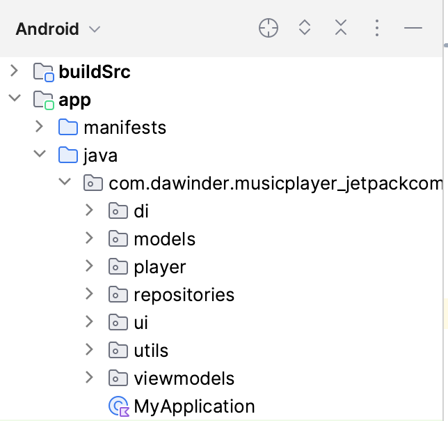

[](https://ktlint.github.io/)
[](https://developer.android.com/jetpack/compose)
[](https://kotlinlang.org/)
[](https://dagger.dev/hilt/)
[](https://android-arsenal.com/api?level=23)
[](https://opensource.org/licenses/Apache-2.0)

<p align="center"> 
    
</p>

<h1 align="center"> Jetpack Compose Music Player </h1>

Android Clean Architecture in this sample project that presents modern, approach to [Android](https://www.android.com/) application development using [Kotlin](https://kotlinlang.org/) and latest tech-stack.

The goal of the project is to demonstrate best practices, provide a set of guidelines, and present modern Android
application architecture that is modular, scalable, maintainable and testable. This application may look simple, but it
has all of these small details that will set the rock-solid foundation of the larger app suitable for bigger teams and
long application lifecycle management.

A few key concepts and technologies form the cornerstone of this project:

- [__Jetpack Compose__](https://developer.android.com/jetpack/compose): This is the next-generation UI toolkit for Android applications, allowing you to build interfaces through declarative UI patterns, thereby reducing the boilerplate code and helping to bring your app to life more quickly​.
- [__Recomposition__](https://developer.android.com/jetpack/compose/mental-model): In the context of Jetpack Compose, recomposition is the process by which the Compose framework updates your composable functions when the data they read changes, ensuring your UI is always up-to-date​.
- [__Managing States__](https://developer.android.com/jetpack/compose/state): This project demonstrates the appropriate handling of states in a composable function in Jetpack Compose. This is crucial for building dynamic and interactive UIs that can respond to changes in data over time​.
- [__Kotlin DSL and Gradle__](https://docs.gradle.org/current/userguide/kotlin_dsl.html): The Kotlin DSL provides a type-safe and expressive way to model your project using Kotlin. This project uses Kotlin DSL for Gradle, which allows for writing Gradle build scripts in a more expressive and convenient way, leveraging Kotlin's features such as type-safety, null-safety, and IDE support​.
- [__Centralizing Dependencies__](https://proandroiddev.com/better-dependencies-management-using-buildsrc-kotlin-dsl-eda31cdb81bf): To maintain a clean and manageable build system, this project centralizes its dependencies in a single location, making it easy to manage and update the dependencies across modules​ using ``buildSrc + Kotlin DSL``.

## Environment
Android Studio verison used : ``Android Studio Giraffe | 2022.3.1 Beta``

## Architecture
A well planned architecture is extremely important for an app to scale and all architectures have one common goal- to manage complexity of your app. This isn't something to be worried about in smaller apps however it may prove very useful when working on apps with longer development lifecycle and a bigger team. I have followed [MVVM](https://en.wikipedia.org/wiki/Model–view–viewmodel#/media/File:MVVMPattern.png) and [Jetpack MVVM](https://developer.android.com/topic/libraries/architecture/viewmodel?gclid=Cj0KCQjw7uSkBhDGARIsAMCZNJt_mWWfTKwCpnS5Tm4VMWMgRZtJuM9xZf-env0SIKXA7-VmOt8g3ccaAtWqEALw_wcB&gclsrc=aw.ds) architecture in this project.

### Why Clean Architecture?
- ```Loose coupling between the code``` - The code can easily be modified without affecting any or a large part of the app's codebase thus easier to scale the application later on.
- Easier to ```test``` code.
- ```Separation of Concern``` - Different modules have specific responsibilities making it easier for modification and maintenance.

### S.O.L.I.D Principles

- [__Single Responsibility__](https://en.wikipedia.org/wiki/Single-responsibility_principle): Each software component should have only one reason to change – one responsibility.
- [__Open-Closed__](https://en.wikipedia.org/wiki/Open%E2%80%93closed_principle#:~:text=In%20object%2Doriented%20programming%2C%20the,without%20modifying%20its%20source%20code.): You should be able to extend the behavior of a component, without breaking its usage, or modifying its extensions.
- [__Liskov Substitution__](https://en.wikipedia.org/wiki/Liskov_substitution_principle): If you have a class of one type, and any subclasses of that class, you should be able to represent the base class usage with the subclass, without breaking the app.
- [__Interface Segregation__](https://en.wikipedia.org/wiki/Interface_segregation_principle): It’s better to have many smaller interfaces than a large one, to prevent the class from implementing the methods that it doesn’t need.
- [__Dependency Inversion__](https://en.wikipedia.org/wiki/Dependency_inversion_principle): Components should depend on abstractions rather than concrete implementations. Also higher level modules shouldn’t depend on lower level modules.

## Layers

### Project Structure
<p align="center"></p>
<p align="center"></p>

### BuildSrc Module
The ``buildSrc`` layer is responsible for dependency management. It control and manage all dependencies in one place with Kotlin.

### App Module
This module contails all the application relates classes, divided into different packages based on their responsibilities.

- __di__: This package handles ``Dependency Injection`` in your project. It includes classes like ``AppModule`` and ``DataModule``, which are used to provide instances of your dependencies to the parts of your app that need them. This helps to separate the responsibility of creating and managing dependencies from the classes that use them.
- __models__: The ``Track class`` in this package is the main model for your tracks. This model encapsulates the data associated with a track and any behavior that directly relates to this data. This maintains a separation of concerns by keeping the data and behavior related to tracks in a dedicated place.
- __player__: This package includes classes related to the ``music player`` functionality of your app, such as MyPlayer, PlayBackState, PlayerEvents, and PlayerStates. These classes handle all the logic related to playing music, including managing playback state and handling player events. This helps to separate the music playing functionality from other aspects of your app.
- __repositories__: This package contains the ``TrackRepository`` and ``TrackRepositoryImpl``, which are responsible for providing track data. Repositories act as a sort of "middleman" between your data sources (like a database or network API) and the rest of your app. This helps to separate the responsibility of data management from the classes that use the data.
- __ui__: This package contains all the user interface code for your app, divided into sub-packages like ``activities, composables, and theme``. This separation of concerns makes it easier to manage your UI code and keeps it separate from your data and business logic.
- __utils__: This package typically contains ``utility classes and functions`` that provide common functionality needed in various places in your app. By placing these utilities in their own package, you can keep them separate from your main app code and make them easier to find and use.
- __viewmodels__: The ``HomeViewModel`` in this package controls the states of your composables. In the ``MVVM (Model-View-ViewModel) architecture``, the ViewModel is responsible for preparing and managing the data for the UI and handling user interactions. This helps to separate the UI logic from the business logic and makes your UI easier to test.

By dividing your code into these packages, you're following the ``principle of separation of concerns``. Each part of your code has a specific responsibility, and it's clear where to find and modify the code for each of these responsibilities. This makes your code easier to ``understand, test, and maintain``.

# Tech Stacks
This project uses many of the popular libraries, plugins and tools of the android ecosystem.

- [Jetpack Compose](https://developer.android.com/jetpack/compose) - Jetpack Compose is Android’s recommended modern toolkit for building native UI. It simplifies and accelerates UI development on Android. Quickly bring your app to life with less code, powerful tools, and intuitive Kotlin APIs.

- [Material3](https://developer.android.com/jetpack/androidx/releases/compose-material3) - Build Jetpack Compose UIs with ready to use Material Design Components.

- [Foundation](https://developer.android.com/jetpack/androidx/releases/compose-foundation) - Write Jetpack Compose applications with ready to use building blocks and extend foundation to build your own design system pieces.

- [UI](https://developer.android.com/jetpack/androidx/releases/compose-ui) - Fundamental components of compose UI needed to interact with the device, including layout, drawing, and input.

- [ModalBottomSheetLayout](https://m3.material.io/components/bottom-sheets/overview) - We can call this BottomSheetDialog of Jetpack Compose.

- [Android KTX](https://developer.android.com/kotlin/ktx.html) - Provide concise, idiomatic Kotlin to Jetpack and Android platform APIs.

- [AndroidX](https://developer.android.com/jetpack/androidx) - Major improvement to the original Android [Support Library](https://developer.android.com/topic/libraries/support-library/index), which is no longer maintained.

- [Lifecycle](https://developer.android.com/topic/libraries/architecture/lifecycle) - Perform actions in response to a change in the lifecycle status of another component, such as activities and fragments.

- [ViewModel](https://developer.android.com/topic/libraries/architecture/viewmodel) - Designed to store and manage UI-related data in a lifecycle conscious way. The ViewModel class allows data to survive configuration changes such as screen rotations.

- [Media3 ExoPlayer](https://developer.android.com/guide/topics/media/exoplayer) - A media player is an app-level component that allows playback of video and audio files. Such files can be stored locally or streamed over the Internet. Jetpack Media3 provides a Player interface that defines basic functionality such as the ability to play, pause, seek, and display track information.

- [Compose Lottie](https://github.com/airbnb/lottie/blob/master/android-compose.md) - Lottie is a mobile library for Android and iOS that parses Adobe After Effects animations exported as json with Bodymovin and renders them natively on mobile!

- [Compose Glide](https://bumptech.github.io/glide/int/compose.html) - An image loading library to load images, downsampling, cache without any memory leak.
    
- [Dagger Hilt](https://dagger.dev/hilt/) - Hilt is a dependency injection library for Android that reduces the boilerplate of doing manual dependency injection in your project.

- [Coroutines](https://github.com/Kotlin/kotlinx.coroutines) - A coroutine is a concurrency design pattern that you can use on Android to simplify code that executes asynchronously.

- [Flow](https://developer.android.com/kotlin/flow) - Flows are built on top of coroutines and can provide multiple values. A flow is conceptually a stream of data that can be computed asynchronously.

- [Google-KSP](https://github.com/google/ksp/) - Kotlin Symbol Processing (KSP) is an API for building lightweight compiler plugins in Kotlin, enabling powerful tooling capabilities such as custom lint checks, code generation, and more.

- [Gradle Kotlin DSL](https://gradle.org/kotlin/) - It makes it easy to manage dependency all module that we have.


## How to use

1. Clone this repository to your machine.
2. Open Android Studio and import the project.
3. Navigate to ``local.properties`` file and add the ``BASE_URL`` key with your ``server URL`` for the music files.
4.  Add your tracks in ``repositories>TrackRepositoryImpl`` under ``createTracks()`` method.
5.  Build and run the project.


## 🤝 Contributing

Contributions are what make the open source community such an amazing place to be learn, inspire,
and create. Any contributions you make are **greatly appreciated**.

**Note** : Please note that while this project focuses primarily on the use of ``Jetpack Compose``, it does not currently incorporate the use of ``foreground services`` for playing music in the background. This is an area where contributions would be particularly valuable, as foreground services are recommended for such functionality in Android development.

If you would like to contribute, please follow these steps:

1. Open an issue first to discuss what you would like to change.
2. Fork the Project
3. Create your feature branch (`git checkout -b feature/amazing-feature`)
4. Commit your changes (`git commit -m 'Add some amazing feature'`)
5. Push to the branch (`git push origin feature/amazing-feature`)
6. Open a pull request

Please make sure to update tests as appropriate.

## ✍️ Author


👤 **DawinderGill**

[](https://www.linkedin.com/in/dawinder-singh-gill-2b1833171)

Feel free to ping me 😉


## License

```license
Copyright © 2023 - DawinderGill

Licensed under the Apache License, Version 2.0 (the "License");
you may not use this file except in compliance with the License.
You may obtain a copy of the License at

   http://www.apache.org/licenses/LICENSE-2.0

Unless required by applicable law or agreed to in writing, software
distributed under the License is distributed on an "AS IS" BASIS,
WITHOUT WARRANTIES OR CONDITIONS OF ANY KIND, either express or implied.
See the License for the specific language governing permissions and
limitations under the License.
